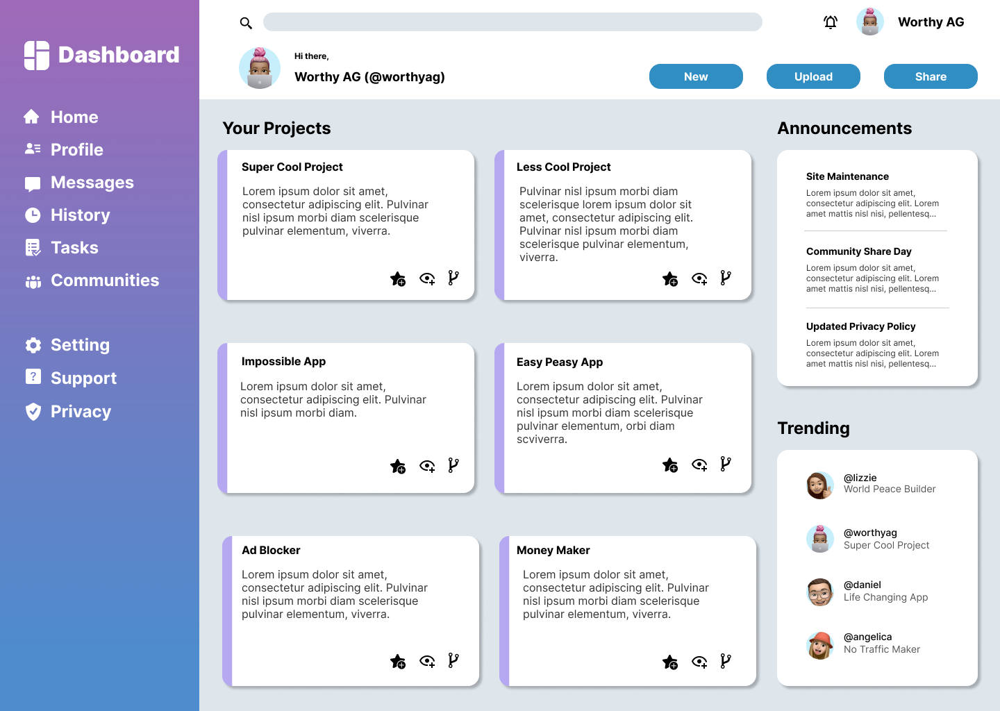

> Tailwind
**Actividad 6**

# CSS Tailwind #

En esta actividad practicaremos CSS Tailwind y cómo aplicarlo a un documento HTML.

## Objetivos ##

- Utilizar Css **Tailwind** en un proyecto *HTML*.
- Familizarizarse con las **clases** de Tailwind.
- Subir nuestra versión a [GitHub](https://github.com/)

---

### **Iniciamos la actividad** ###

1. Entrar en la carpeta donde vamos a ubicar la actividad:
    1. Abre la **terminal**.
    2. Con los comandos `cd` y `cd ..` navegamos por nuestro ordenador hasta llegar a la dirección dónde queremos ubicar la actividad.

2. Abrir en enlace de la actividad en el navegador.
3. Clonar la actividad:
    1. Copiamos el link *https* del botón *Clone* de nuestro **Github**.
    2. Vamos a la **terminal** y, dentro de la carpeta donde queremos ubicar la actividad, escribimos el comando `git clone + (pegamos el link que habíamos copiado)`.

4. Abrir la actividad en el **Visual Studio Code**
    1. Entramos dentro de la carpeta que se ha generado con el comando `git clone`, haciendo `cd + (el nombre de la carpeta clonada)`.
    2. Dentro de la carpeta, escribimos el comando `code .` para abrir esta carpeta en el **VSC**.

---

#### :raised_hand::warning: Antes de empezar :point_down: ####

Para utilizar **Tailwind** en nuestro proyecto tendremos que seguir los siguientes pasos:

1. Abrir la carpeta del repositorio en la **terminal**.

2. Ejecutar el siguiente comando: `npm install`.

3. Una vez terminen de instalarse las dependencias, ejecutamos este otro comando: `npm start`.

4. Veremos que nuestra terminal queda inutilizada compilando, así que tendremos que abir otra para ejecutar los [comandos de guardado](#mientras-trabajamos-en-la-actividad)

5. No debemos cerrar la terminal compiladora hasta que queramos pararla. Para ello, utilizamos el comando: `ctrl + c` 

---

### :point_right: **Ejercicio** ###

- Trabajaremos el archivo **index.html**.
- Intentaremos replicar la siguiente una (o varias) de las siguientes páginas:

#### Opción 1 ####

---

#### Opción 2 ####

---

#### Opción 3 ####

---

### **Mientras trabajamos en la actividad** ###

Mientras trabajamos en la actividad es muy importante ir guardando los cambios que vamos haciendo. Este **proceso de guardado** será el siguiente: 

1. El clásico `ctrl + s` o `cmd + s` en nuestro archivo del **VSC**.
2. Abrimos la **terminal**, comprobamos que nos encontramos en la ruta correcta y escribimos los siguientes comandos:
    1. `git add .`
    2. `git commit -m "mensaje"`
    3. `git push`

3. Vamos al navegador y comprobamos que se ha hecho correctamente en nuestro **Github**.

---

### Recursos ###

- [Recurso 1](https://tailwindcss.com/docs/utility-first)

- [Instalación de Tailwind en un proyecto](https://tailwindcss.com/docs/installation)

- [Recurso 3](https://www.youtube.com/c/TailwindLabs)

